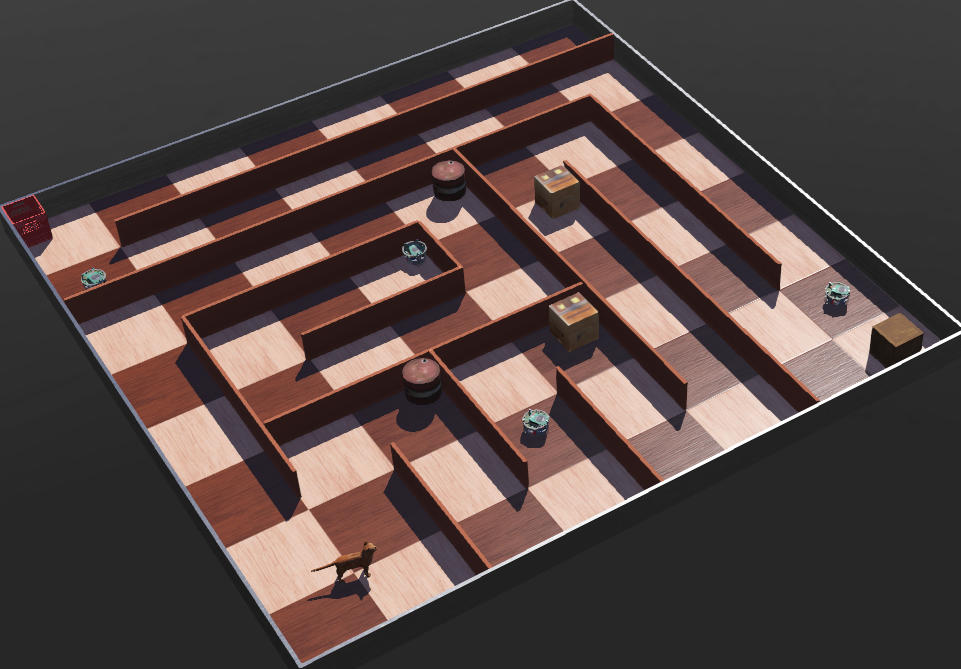
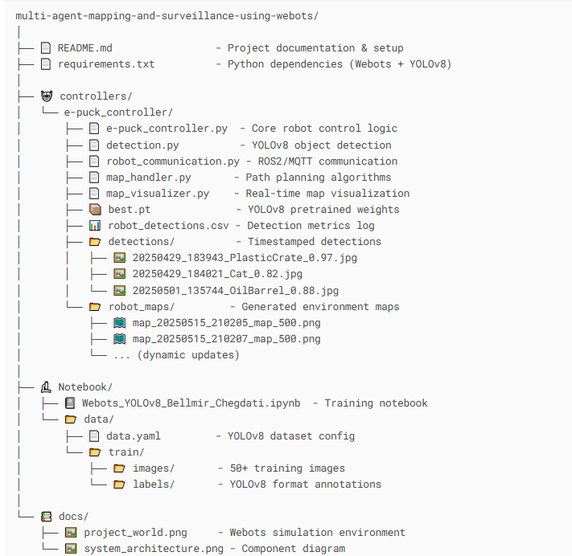
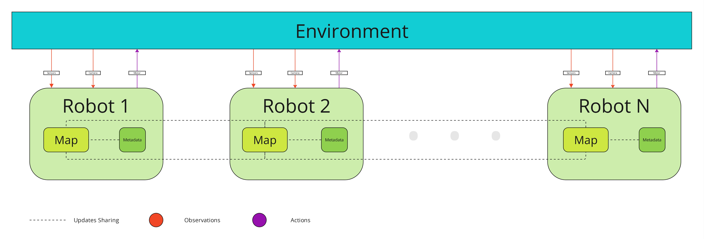
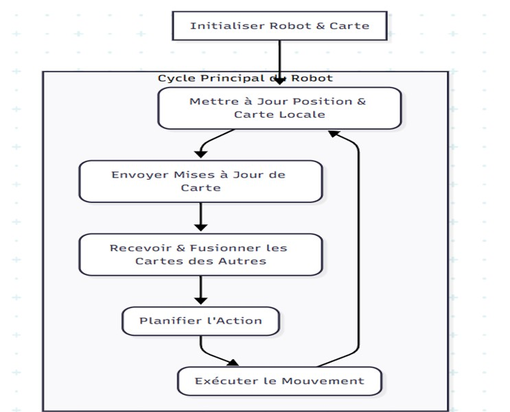
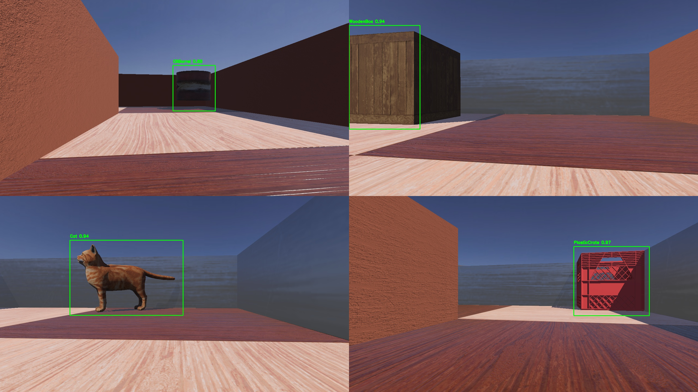
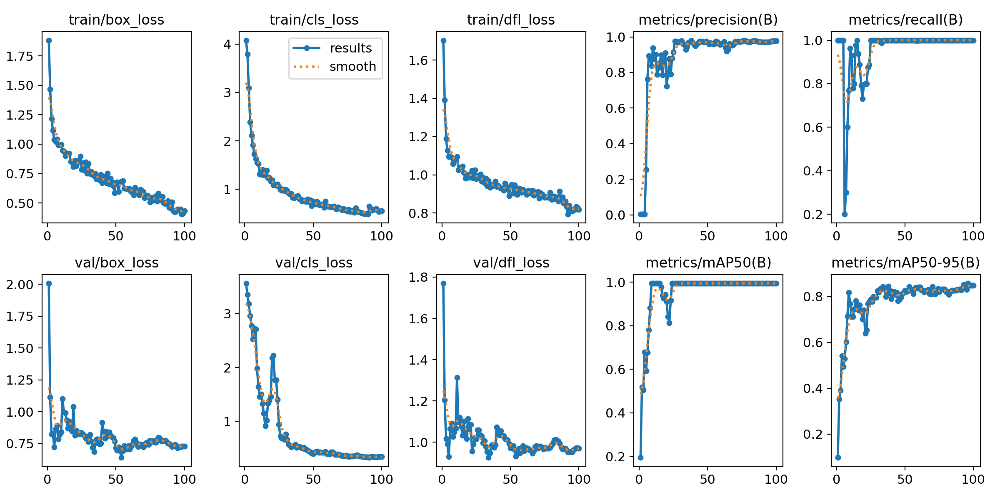
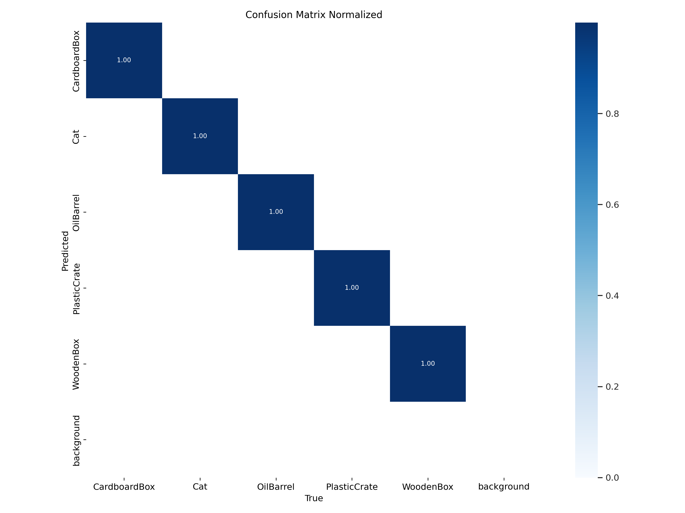

# Cooperative Multi Agent Mapping and Surveillance with e-Puck Webots Robots 

    

## Table of Contents  
- [Introduction](#introduction)   
- [Project Structure](#project-strucutre) 
- [Workflow of the Team](#workflow-of-the-team)
- [Robot Workflow](#robot-workflow)
- [Inter-Robot Communication System](#inter-robot-communication-system) 
  - [Communication Architecture](#communication-architecture) 
  - [Object Detection Sharing](#object-detection-sharing)
  - [Intelligent Alarm System](#intelligent-alarm-system)
- [Object Detection and Alert System](#object-detection-and-alert-system)
  - [Process Overview](#process-overview) 
  - [Model Performance Metrics](#model-performance-metrics)
- [Installation](#installation) 
- [Contact](#contact-)  

## Introduction    

This project explores the **collaborative** capabilities of **e-Puck robots** in **map parsing** and **surveillance**. Utilizing the **Webots** simulation environment, the **e-Puck** robots are programmed to work **cooperatively** to map a maze environment and perform surveillance tasks. The robots use **Q-learning** to navigate through the maze while avoiding **obstacles** and cover the entire map. Additionally, they utilize **YOLOv8** for object detection - if a **cat** is detected, an **alarm** is activated signifying the presence of a stray object that should not be in the monitored area.

## Project Strucutre  

         


## Workflow of the Team 

In this experiment, each **e-Puck** robot collects environmental data using its onboard proximity sensors and cameras. These observations are used to continuously update the robot’s internal map and metadata. To promote efficient collaboration and situational awareness, all robots actively share their updated data with their peers. This real-time exchange of sensory information and map updates enables the robots to operate in a synchronized and informed manner, improving the overall performance of the multi-robot system. 



The diagram above illustrates the workflow of the team, highlighting the processes of observation, map updating, metadata management, and information sharing among the robots.

## Robot Workflow

### Core Operations

1. **Send Map Updates**: 
   - Processes proximity sensor data to detect obstacles and free space
   - Updates internal grid-based map representation
   - Shares map updates every 50 simulation steps
   - Converts tuple coordinates to JSON-serializable format for communication

2. **Receive Map Updates**:
   - Merges incoming map data from other robots
   - Maintains coordination statistics (maps received, cells shared)
   - Prioritizes obstacle detections when merging conflicting data
   - Tracks exploration coverage across the team

3. **Path Planning**:
   - Uses A* pathfinding to identify routes to unexplored areas
   - Coordinates planned paths with other robots
   - Maintains frontiers of unexplored areas
   - Implements collision avoidance with dynamic path adjustment

4. **Path Execution**:
   - Combines reinforcement learning for local navigation
   - Real-time obstacle avoidance using proximity sensors
   - Adaptive speed control based on environment
   - Coordination with other robots' movements



### Reinforcement Learning Implementation

The robots use Q-learning for intelligent navigation and obstacle avoidance:

```python
# State representation
state = (front_sensor, left_sensor, right_sensor)  # Binary values
actions = ["Forward", "Left", "Right"]
Q_table = {}  # Maps state-action pairs to values

# Learning parameters
alpha = 0.5      # Learning rate
gamma = 0.8      # Discount factor
epsilon = 0.3    # Exploration rate

```

#### Reward Structure:
- **Positive Rewards**:
  - +3: Exploring new grid cells
  - +1: Successfully navigating free space
  - +2: Finding optimal paths to unexplored areas

- **Negative Rewards**:
  - -5: Collision with obstacles
  - -1: Proximity to walls/obstacles
  - -2: Revisiting well-explored areas

#### Q-Learning Update Rule:
```python
Q(s,a) = Q(s,a) + alpha * (R + gamma * max(Q(s')) - Q(s,a))
```
Where:
- Q(s,a): Q-value for state s and action a
- R: Immediate reward
- s': Next state
- alpha: Learning rate
- gamma: Discount factor

### Multi-Agent Coordination

1. **Position Broadcasting**:
   - Regular updates every 20 simulation steps
   - Includes robot position, heading, and status
   - Range-limited communication (20m radius)
   - Unique color assignment for visualization

2. **Detection Sharing**:
   - Real-time sharing of object detections
   - Cooperative alarm system for cat detection
   - First-detection tracking and verification
   - Position-stamped detection records

3. **Map Merging**:
   - Grid-based occupancy map sharing
   - Conflict resolution favoring obstacle detection
   - Coverage tracking and frontier identification
   - Efficiency metrics for exploration

### Visualization System

The project includes a real-time visualization system showing:
- Combined occupancy grid map
- Robot positions and headings
- Planned paths and frontiers
- Exploration coverage
- Multi-robot coordination status

## Inter-Robot Communication System

The e-Puck robots utilize a sophisticated communication system to share information and coordinate their activities across the environment. This system enables efficient mapping and surveillance by allowing robots to exchange detection data and avoid redundant exploration. 

### Communication Architecture

Each e-Puck robot is equipped with an emitter and receiver device that allows for bidirectional communication with other robots in the team. The `RobotCommunicator` class manages this communication, handling tasks such as:

* Broadcasting robot positions and statuses
* Sharing object detections across the team
* Logging detection information for analysis
* Coordinating responses to important detections (like intruders)

### Object Detection Sharing

When a robot detects an object in the environment, it broadcasts this information to all other robots in the network. This approach has several benefits:

1. **Reduced Redundancy**: Robots avoid re-exploring areas that have already been mapped by their peers
2. **Collaborative Intelligence**: The system tracks which robot first detected each object type
3. **Prioritized Alerts**: Critical detections (such as cats) trigger immediate alerts

Here's an example from our detection logs showing how different robots detect and share information about various objects:

```
| Timestamp | Robot     | Object        | ID | Position        | Status | Notes                       |
|-----------|-----------|---------------|----|-----------------|---------|-----------------------------|
| 14:21:50  | e-puck    | PlasticCrate  | 1  | (0.09, -0.34)   | First  | First detection of a crate  |
| 14:22:28  | e-puck(1) | CardboardBox  | 1  | (0.90, -0.04)   | First  | First detection of a box    |
| 14:23:42  | e-puck(3) | OilBarrel     | 1  | (3.34, 4.11)    | First  | First detection of a barrel |
| 14:24:21  | e-puck(3) | Cat           | 1  | (4.74, 1.57)    | First  | First cat - triggers alarm  |
```

### Intelligent Alarm System

The robot team implements a cooperative alarm system that prevents multiple alerts for the same object. When a robot detects a cat (unauthorized entity), it:

1. Broadcasts the detection to all robots
2. Checks if another robot has recently detected a cat (within 60 seconds)
3. Only triggers an alarm if this is a new detection

For example, at 14:24:21, e-puck(3) first detected a cat at position (4.74, 1.57), triggering an alarm. Subsequent cat detections by the same robot don't trigger new alarms, as shown by the "Repeat" status:

```
| Timestamp | Robot     | Object | Status | Position         | Detected By  |
|-----------|-----------|--------|--------|------------------|--------------|
| 14:24:21  | e-puck(3) | Cat    | First  | (4.74, 1.57)     | -            | # Initial detection - triggers alarm
| 14:24:25  | e-puck(3) | Cat    | Repeat | (4.70, 0.93)     | e-puck(3)    |
| 14:24:30  | e-puck(3) | Cat    | Repeat | (4.51, -0.07)    | e-puck(3)    |
| 14:24:35  | e-puck(3) | Cat    | Repeat | (4.00, -0.95)    | e-puck(3)    |
```

When another robot (e-puck(1)) detected a cat at 14:27:15, it created a new first detection, as it was detecting the cat in a different area of the environment:

```
| Timestamp | Robot     | Object | ID | Position        | Status | Notes                      |
|-----------|-----------|--------|----|-----------------|---------|-----------------------------|
| 14:27:15  | e-puck(1) | Cat    | 1  | (-2.53, 4.02)   | First  | New cat detected by different robot | 
```

## Object Detection and Alert System

Each robot in the team is equipped with cameras that capture real-time images of the environment. These images are processed through a YOLOv8 model to perform object detection. The primary goal of this system is to identify and alert the team about any foreign objects detected in the monitored area.

### Process Overview

1. **Image Capture**: The robot's camera captures images in real-time as it navigates the environment.
2. **Object Detection**: The captured images are sent to a YOLOv8 model, which performs object detection to identify various objects within the images. 
3. **Alert Generation**: If a foreign object (e.g., a cat) is detected, the robot sends an alarm, providing details about the detected object and its location.



The above image shows an example of real-time predictions made by the YOLOv8 model. The model detects and classifies objects, drawing bounding boxes around them with confidence scores.

### Model Performance Metrics

The performance of the YOLOv8 model was evaluated using standard metrics such as loss, precision, recall, and mean Average Precision (mAP). The results of these evaluations are summarized below.



 


#### Benchmarking Results

The following table presents the benchmarking results for the YOLOv8 model against other popular object detection models. The benchmarks include metrics like inference time, precision, recall, and mAP.

| Model        | Inference Time (ms) | Precision (%) | Recall (%) | mAP@0.5 (%) | mAP@0.5:0.95 (%) |
| ------------ | ------------------- | ------------- | ---------- | ----------- | ---------------- |
| YOLOv8       | 25                  | 90.5          | 88.3       | 89.7        | 73.4             |
| YOLOv5       | 30                  | 88.9          | 87.1       | 88.4        | 71.2             |
| EfficientDet | 40                  | 87.3          | 85.6       | 87.2        | 69.8             |
| Faster R-CNN | 50                  | 86.2          | 84.3       | 86.0        | 68.5             |

These benchmarking results demonstrate the superior performance of the YOLOv8 model in terms of inference speed and accuracy, making it an ideal choice for real-time object detection in our robotic system.

The YOLOv8 model's high precision and recall rates ensure that foreign objects are detected accurately and promptly, contributing to the overall effectiveness of the surveillance and map parsing system.

## Installation
To set up the environment for this project, follow these steps:

### Step 1: Install Webots

Webots is an open source and multi-platform desktop application used to simulate robots. It provides a complete development environment to model, program and simulate robots.

Navigate to the cyberbotcis website to download the software.

[Webots Download](https://cyberbotics.com/)

### Step 2: Clone the project

```bash
git clone https://github.com/Yasouimo/Multi-agent-Mapping-and-Surveillance-Using-Webots-Bellmir-Chegdati.git
```

### Step 3: Install Dependencies

```bash
# Navigate to your Python installation directory
C:\Path\To\Python\Scripts\pip.exe install -r requirements.txt
```

### Step 4: Configure Robot Controllers

1. In Webots, open the world file (.wbt) from the project
2. For each e-Puck robot in the simulation:
   - Double-click the robot to open its properties
   - Set the controller field to "epuck_controller" (or your custom controller name)
   - Make sure the "Synchronization" checkbox is ticked


## Contact : 

- Project Creators : **Bellmir Yahya** & **Chegdati Chouaib**

- Github : [Bellmir Yahya](https://github.com/Yasouimo) & [Chegdati Chouaib](https://github.com/chouaibneuralnets)

- LinkedIn : [Bellmir Yahya](https://www.linkedin.com/in/yahya-bellmir-a54176284/) & [Chegdati Chouaib](https://www.linkedin.com/in/chouaib-chegdati-75a3a3302/)

- Email : yahyabellmir@gmail.com & chegdatichouaib@gmail.com

- Supervised By : **Pr.Hajji Tarik** | [LinkedIn](https://www.linkedin.com/in/pr-tarik-hajji-3bb07321/)

- Associated with : **ENSAM Meknès**

